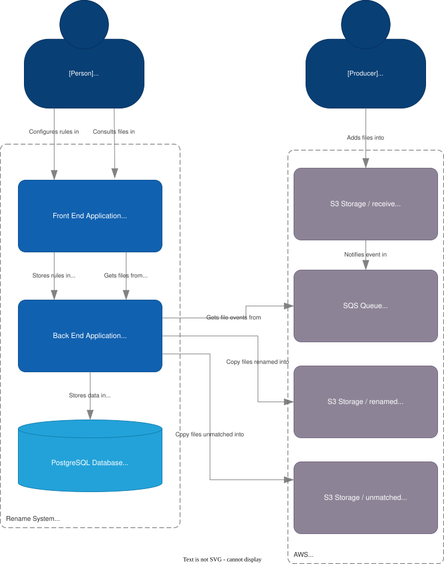

# Renombramiento-Inteligente-de-Archivos-en-S3

Made by German David Guerrero Guerrero

## How to execute

Create a `.env` file at root of project. Set the required properties.\

Make sure to have an bucket name with the same name as the property in `app.aws.bucket-name` in [application.yml](gft-rename/src/main/resources/application.yaml)

Make sure to have the folders `receive`, `renamed`, `unmatched` in the aws bucket

Make sure to have an sqs queue wich hears the post an put events from the `receive` folder in the aws s3 bucket. It mos be named as the as the property in `app.aws.sqs-queue-name` in [application.yml](gft-rename/src/main/resources/application.yaml) (Default `file-creation-to-rename`)

run `docker compose up`. It automatically runs every component needed.

Backend runs on port 8080
Front end runs on port 80
Database runs on port 5432

## Architecure

